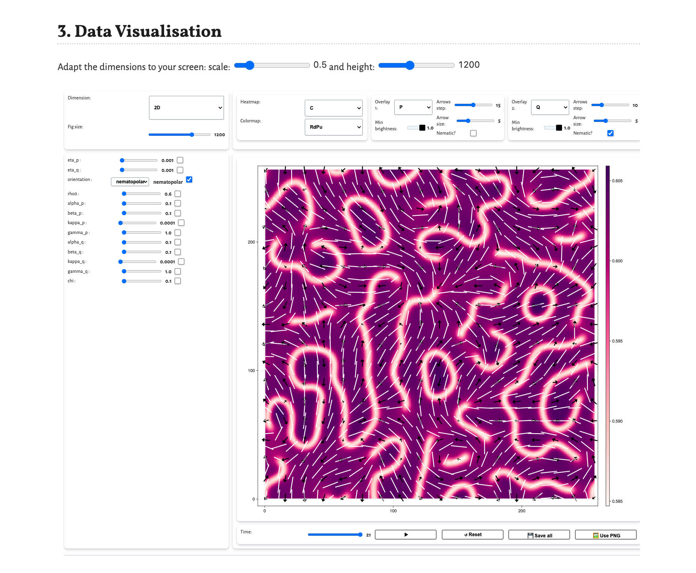

# HydraFluids

A [Pluto.jl](https://plutojl.org/)-based simulation framework for studying the hydrodynamics of **renewing active fluids** with optional orientation fields (polar, nematic, or nematopolar). Simulations run on CPU or GPU (CUDA / Metal) using [ParallelStencil.jl](https://github.com/omlins/ParallelStencil.jl) with pseudo-spectral (FFT) spatial discretization.

Results from this codebase are published in:
- [Defect states in compressible active polar fluids with turnover](https://arxiv.org/pdf/2506.03795)
- [Active topological strings in renewing nematopolar fluids](https://arxiv.org/pdf/2601.18307)

---

## Physics

The model describes a 2D compressible active fluid on a periodic square lattice. The density field $\rho$ follows a continuity equation with diffusion and a renewal (turnover) term that drives the system back to a target density $\rho_0$. The system supports three optional orientation fields, selected at runtime:

| Mode | Fields | Description |
|---|---|---|
| `none` | — | Density only |
| `polar` | $\mathbf{p}$ | Polar vector field |
| `nematic` | $\mathbf{Q}$ | Traceless symmetric nematic tensor |
| `nematopolar` | $\mathbf{p}$, $\mathbf{Q}$ | Both fields coupled via $\chi$ |

The free energy functional is:

$$\mathcal{F} = \int \mathrm{d}^2r \left[ f_\rho + f_p + f_Q + f_{pQ} \right]$$

with renewal dynamics, flow alignment, active stresses, and adaptive time-stepping. See the papers above for the full equations.

---

## Project Structure

```
HydraFluids/
├── Notebook.pluto.jl          # Main entry point — start here
└── src/
    ├── GenInputParams.pluto.jl  # Step 1: define parameter sweeps
    ├── CommonUI/                # Auto-cloned from github.com/Lu-Dumoulin/CommonUI
    │   ├── RunSimulations.pluto.jl   # Step 2: launch jobs (local or cluster)
    │   ├── DataVisualisation.pluto.jl # Step 3: explore results
    │   └── utils/
    └── sim/
        ├── main.jl            # Simulation entry point (called by RunSimulations)
        ├── InputParams.jl     # Reads parameters from DF.csv row
        ├── kernels.jl         # GPU/CPU kernels (ParallelStencil)
        ├── utils.jl           # Trait system, IO helpers
        └── DF.csv             # Generated parameter table (one row per simulation)
```

---

## Getting Started

### Prerequisites

- Julia ≥ 1.10
- Pluto.jl

```julia
using Pkg; Pkg.add("Pluto"); import Pluto; Pluto.run()
```

### Workflow

Open `Notebook.pluto.jl` in Pluto — it guides you through the following steps:

**Step 0 — Pull CommonUI**

The notebook will clone [CommonUI](https://github.com/Lu-Dumoulin/CommonUI) into `src/CommonUI/` automatically when you toggle the switch. This only needs to be done once (or to update).

**Step 1 — Generate parameters (`src/GenInputParams.pluto.jl`)**

Define parameter sweeps using the interactive widgets. The notebook builds a full-factorial `DataFrame` from all combinations and saves it to `src/sim/DF.csv`. Each row is one simulation.

**Step 2 — Run simulations (`src/CommonUI/RunSimulations.pluto.jl`)**

Launch jobs locally (CPU threads or GPU) or submit a Slurm array job to an HPC cluster. Simulation output is saved as `.jld2` snapshots containing fields `C` (density), `V` (velocity), `P` (polar), `Q` (nematic).

**Step 3 — Visualise results (`src/CommonUI/DataVisualisation.pluto.jl`)**

Explore simulation output interactively using [DataVisualisation.jl](https://github.com/Lu-Dumoulin/DataVisualisation.jl).

---

## Simulation Parameters

All parameters are set in `GenInputParams.pluto.jl` and stored as columns in `DF.csv`.

### Numerics

| Parameter | Description |
|---|---|
| `N` | Square lattice side length (multiple of 16, e.g. `16 × k`) |
| `dx` | Spatial discretization: $\Delta x = 2^{-n}$ |
| `dt_ini` / `dt_max` | Initial and maximum adaptive time step |
| `t_check` | Interval between adaptive time-step updates |
| `t_print` | Interval between data saves |
| `t_end` | Total simulation duration |

### Initialization

| Parameter | Values / Description |
|---|---|
| `orientation` | `none`, `polar`, `nematic`, `nematopolar` |
| `initialisation` | `Homogeneous`, `Polarized`, `Loop` |
| `seed` | Random seed |
| `eta_rho`, `eta_p`, `eta_q` | Noise amplitudes for $\rho$, $\mathbf{p}$, $\mathbf{Q}$ |

**Loop** initialisation places a circular defect loop in a polarized nematopolar background (requires `nematopolar` mode).

### Density field

| Parameter | Description |
|---|---|
| `a` | Steric free energy coefficient |
| `zeta` | Isotropic active stress $\zeta_\rho$ |
| `D` | Diffusion coefficient |
| `tau` | Renewal time $\tau$ |
| `rho0` | Target density $\rho_0$ |

### Polar field ($\mathbf{p}$)

| Parameter | Description |
|---|---|
| `alpha_p`, `beta_p`, `kappa_p` | Free energy: $\alpha_p$, $\beta_p$, $\kappa_p$ |
| `zeta_p`, `zeta_p2` | Active polar stress coefficients |
| `gamma_p` | Rotational viscosity $\Gamma_p$ |
| `nu`, `nu2` | Flow alignment $\nu$, $\bar\nu$ |
| `epsi_p` | Active extensile term $\varepsilon_p$ |

### Nematic field ($\mathbf{Q}$)

| Parameter | Description |
|---|---|
| `alpha_q`, `beta_q`, `kappa_q` | Free energy: $\alpha_Q$, $\beta_Q$, $\kappa_Q$ |
| `zeta_q` | Active nematic stress $\zeta_Q$ |
| `gamma_q` | Rotational viscosity $\Gamma_Q$ |
| `lambda` | Flow alignment $\lambda$ |
| `epsi_q` | Active extensile term $\varepsilon_Q$ |

### Nematopolar coupling

| Parameter | Description |
|---|---|
| `chi` | Coupling constant $\chi$ between $\mathbf{p}$ and $\mathbf{Q}$ |

---

## Numerical Method

- **Spatial derivatives** — computed pseudo-spectrally via `rfft`/`fft` (FFTW).
- **Velocity field** — solved in Fourier space from the non-viscous stress tensor.
- **Time integration** — explicit Euler with adaptive time step (CFL-like condition on $|\mathbf{V}|_\infty$).
- **GPU backends** — CUDA (NVIDIA), Metal (Apple Silicon), or CPU threads (`Threads.jl`), selected at runtime from the `use_gpu` environment variable.
- **Trait dispatch** — orientation field variants (`IsNone`, `IsPolar`, `IsNematic`, `IsNematoPolar`) are resolved at compile time with zero runtime branching. The single kernel source compiles into four fully optimised specialisations.

---

## Preview



*Interactive data visualisation of a nematopolar simulation: density heatmap with polar (white arrows) and nematic (black bars) field overlays.*

---

## Related Repositories

| Repository | Role |
|---|---|
| [CommonUI](https://github.com/Lu-Dumoulin/CommonUI) | Shared interactive notebooks and Julia utilities for simulation workflows |
| [DataVisualisation.jl](https://github.com/Lu-Dumoulin/DataVisualisation.jl) | Interactive data exploration for `.jld` or `.jld2` simulation output |
