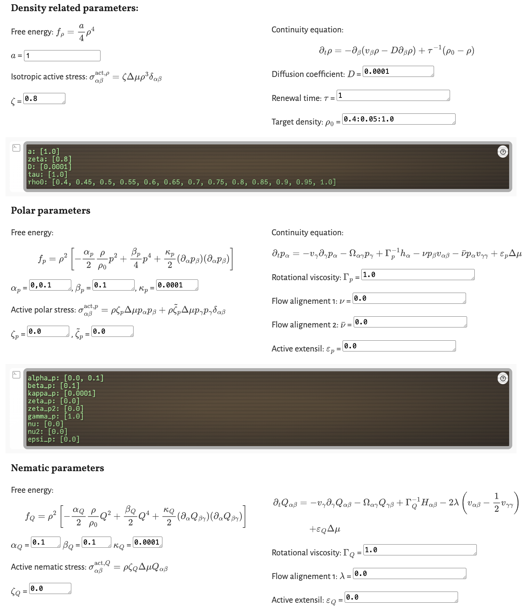
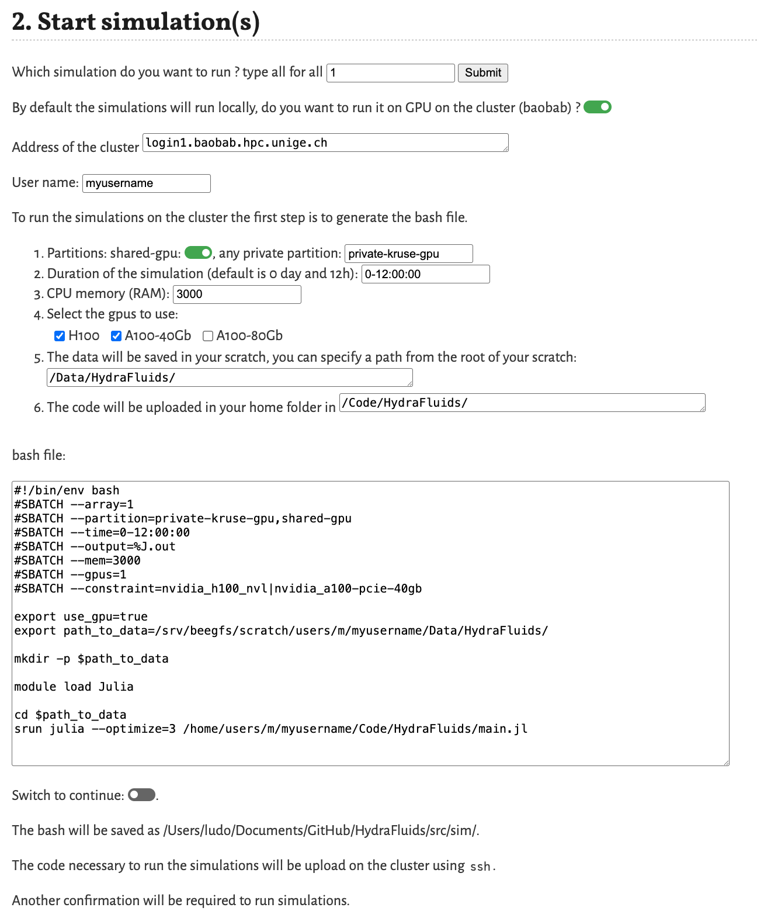
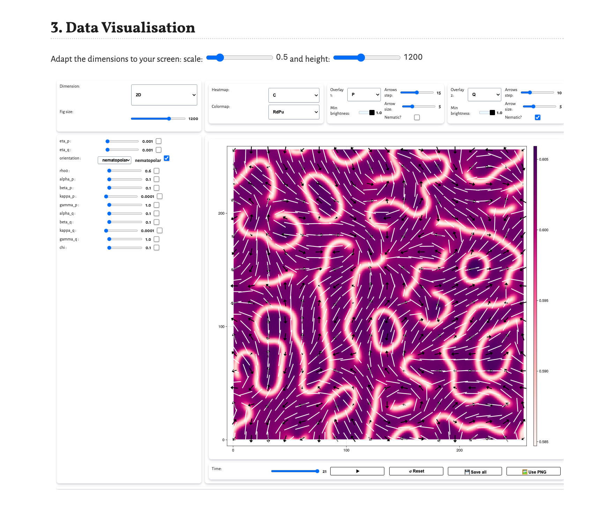

# HydraFluids

A [Pluto.jl](https://plutojl.org/)-based simulation framework for studying the **hydrodynamics of renewing active fluids** with optional orientation fields (polar, nematic, or nematopolar). Simulations run on CPU or GPU (CUDA / Metal) using [ParallelStencil.jl](https://github.com/omlins/ParallelStencil.jl), with a selectable spatial scheme: pseudo-spectral (FFT) or finite differences with an iterative (Jacobi) solver.

Results from this codebase are published in:
- [Defect states in compressible active polar fluids with renewal](https://arxiv.org/pdf/2506.03795)
- [Active topological strings in renewing nematopolar fluids](https://arxiv.org/pdf/2601.18307)

---

## Physics

The model describes a 2D compressible active fluid on a periodic square lattice. The density field $\rho$ follows a continuity equation with diffusion and a renewal (turnover) term that drives the system back to a target density $\rho_0$. The system supports three optional orientation fields, selected at runtime:

| Mode | Fields | Description |
|---|---|---|
| `none` | — | Density only |
| `polar` | $\mathbf{p}$ | Polar vector field |
| `nematic` | $\mathbf{Q}$ | Traceless symmetric nematic tensor |
| `nematopolar` | $\mathbf{p}$, $\mathbf{Q}$ | Both fields coupled via $\chi$ |

The free energy functional is:

$$\mathcal{F} = \int \mathrm{d}^2r \left[ f_\rho + f_p + f_Q + f_{pQ} \right]$$

. See the papers above for the full equations.

---

## Project Structure

```
HydraFluids/
├── Notebook.pluto.jl          # Main entry point — start here
└── src/
    ├── GenInputParams.pluto.jl  # Step 1: define parameter sweeps
    ├── CommonUI/                # Auto-cloned from github.com/Lu-Dumoulin/CommonUI
    │   ├── RunSimulations.pluto.jl   # Step 2: launch jobs (local or cluster)
    │   ├── DataVisualisation.pluto.jl # Step 3: explore results
    │   └── utils/
    └── sim/
        ├── main.jl            # Simulation entry point (called by RunSimulations)
        ├── InputParams.jl     # Reads parameters from DF.csv row
        ├── kernels.jl         # GPU/CPU kernels (ParallelStencil): stress, Fourier velocity solve, p/Q update
        ├── operators.jl       # Spatial schemes (fft, jacobi): derivatives, force balance, density fluxes
        ├── utils.jl           # Trait systems (orientation, solver), IO helpers, package self-install
        └── DF.csv             # Generated parameter table (one row per simulation)
```

---

## Getting Started

### Prerequisites

- Julia ≥ 1.10
- Pluto.jl

```julia
using Pkg; Pkg.add("Pluto"); import Pluto; Pluto.run()
```

### Workflow

Open `Notebook.pluto.jl` in Pluto — it guides you through the following steps:

**Step 0 — Pull CommonUI**

The notebook will clone [CommonUI](https://github.com/Lu-Dumoulin/CommonUI) into `src/CommonUI/` automatically when you toggle the switch. This only needs to be done once (or to update).

**Step 1 — Generate parameters (`src/GenInputParams.pluto.jl`)**

Define parameter sweeps using the interactive widgets. The notebook builds a full-factorial `DataFrame` from all combinations and saves it to `src/sim/DF.csv`. Each row is one simulation.

**Step 2 — Run simulations (`src/CommonUI/RunSimulations.pluto.jl`)**

Launch jobs locally (CPU threads or GPU) or submit a Slurm array job to an HPC cluster. Every `t_print`, a snapshot `Data/NNNNNNNNNN.jld` (JLD2 format; the ten digits are the simulation time) is written with the fields `C` (density), `V` (velocity), `P` (polar), `Q` (nematic).

**Step 3 — Visualise results (`src/CommonUI/DataVisualisation.pluto.jl`)**

Explore simulation output interactively using [DataVisualisation.jl](https://github.com/Lu-Dumoulin/DataVisualisation.jl).

---

## Simulation Parameters

All parameters are set in `GenInputParams.pluto.jl` and stored as columns in `DF.csv`.

### Numerics

| Parameter | Description |
|---|---|
| `N` | Square lattice side length (multiple of 16, e.g. `16 × k`) |
| `dx` | Spatial discretization: $\Delta x = 2^{-n}$ |
| `dt_ini` / `dt_max` | Initial and maximum adaptive time step |
| `t_check` | Interval between adaptive time-step updates |
| `t_print` | Interval between data saves |
| `t_end` | Total simulation duration |
| `solver` | Spatial scheme: `fft` (default) or `jacobi` — see [Numerical Method](#numerical-method) |
| `cce_base`, `cce_cap` | `jacobi` only: first and largest interval (in sweeps) between convergence checks (defaults 10, 100) |
| `max_iter`, `error_threshold` | `jacobi` only: sweep limit and tolerance on the change between sweeps (defaults 10⁵, 10⁻⁶) |
| `gc_every` | Partial garbage collection every `gc_every` time steps (default 20, `0` = off). Keeps memory bounded under a cluster memory limit; no measurable cost and no effect on results. |

Columns added after a table was generated are optional: an older `DF.csv` without `solver` runs with `fft`.

### Initialization

| Parameter | Values / Description |
|---|---|
| `orientation` | `none`, `polar`, `nematic`, `nematopolar` |
| `initialisation` | `Homogeneous`, `Polarized`, `Loop` |
| `seed` | Random seed (initial noise is drawn from its own `Xoshiro(seed)` stream, identical on every backend) |
| `eta_rho`, `eta_p`, `eta_q` | Noise amplitudes for $\rho$, $\mathbf{p}$, $\mathbf{Q}$ |

**Polarized** starts from uniform order along $x$ at the free-energy minimum ($\rho=\rho_0$): $|\mathbf p|=\sqrt{\alpha_p/\beta_p}$ (polar), $Q_{xx}=\tfrac12\sqrt{\alpha_Q/\beta_Q}$ (nematic), or the coupled minimum (nematopolar). **Loop** places a circular defect loop in a polarized nematopolar background (requires `nematopolar` mode). Any other combination stops the run with an error.

### Density field

| Parameter | Description |
|---|---|
| `a` | Steric free energy coefficient |
| `zeta` | Isotropic active stress: $\sigma \ni -\zeta\,\rho^3\,\delta$, so `zeta < 0` is **contractile**. This is the opposite sign to the solver of arXiv:2506.03795, where $\zeta_\rho' > 0$ is contractile (its $\zeta_\rho' = 4$ is `zeta = -4` here, with `a` $= 4|\zeta_\rho'|/3$). |
| `D` | Diffusion coefficient |
| `tau` | Renewal time $\tau$ |
| `rho0` | Target density $\rho_0$ |

### Polar field ($\mathbf{p}$)

| Parameter | Description |
|---|---|
| `alpha_p`, `beta_p`, `kappa_p` | Free energy: $\alpha_p$, $\beta_p$, $\kappa_p$ |
| `zeta_p`, `zeta_p2` | Active polar stress coefficients |
| `gamma_p` | Rotational viscosity $\Gamma_p$ |
| `nu`, `nu2` | Flow alignment $\nu$, $\bar\nu$ |
| `epsi_p` | Active extensile term $\varepsilon_p$ |

### Nematic field ($\mathbf{Q}$)

| Parameter | Description |
|---|---|
| `alpha_q`, `beta_q`, `kappa_q` | Free energy: $\alpha_Q$, $\beta_Q$, $\kappa_Q$ |
| `zeta_q` | Active nematic stress $\zeta_Q$ |
| `gamma_q` | Rotational viscosity $\Gamma_Q$ |
| `lambda` | Flow alignment $\lambda$ |
| `epsi_q` | Active extensile term $\varepsilon_Q$ |

### Nematopolar coupling

| Parameter | Description |
|---|---|
| `chi` | Coupling constant $\chi$ between $\mathbf{p}$ and $\mathbf{Q}$ |

---

## Numerical Method

The domain is an $N\times N$ periodic grid with spacing `dx`. The column `solver` selects how **both** the spatial derivatives and the force balance $\xi\mathbf{V} - (\nabla^2\mathbf{V} + \nabla(\nabla\cdot\mathbf{V})) = \nabla\cdot\sigma$ are computed:

| `solver` | Derivatives | Force balance | Backends | Use it for |
|---|---|---|---|---|
| `fft` (default) | pseudo-spectral (`rfft`, exact for every resolved wave) | exact $2\times2$ solve per Fourier mode | CUDA, CPU | large runs (cluster GPUs) |
| `jacobi` | 2nd-order central finite differences | Jacobi iteration of the same operator | CUDA, CPU, **Metal** | small runs, Apple GPUs (Metal has no FFT) |

- **Time integration** — explicit Euler; every `t_check` the step grows by ×1.25 up to `dt_max`, capped by $0.05\,\Delta x/|\mathbf{V}|_\infty$.
- **Failures** — if the fields or the time step become NaN, the run stops with an error message and a non-zero exit status, so Slurm marks the job as failed.
- **Backends** — CUDA (NVIDIA), Metal (Apple Silicon) or CPU threads, from the `use_gpu` environment variable. CUDA and CPU run in `Float64`, Metal in `Float32`.
- **No allocation in the time loop** — the FFT path reuses three buffers (one real, two complex) for every transform (`mul!` into a buffer instead of creating new arrays).
- **Trait dispatch** — the orientation fields (`IsNone`, `IsPolar`, `IsNematic`, `IsNematoPolar`) and the scheme (`FFTSolver`, `JacobiSolver`) are resolved at compile time, so one kernel source compiles into fully specialised solvers.

**Accuracy of `jacobi`.** Its derivatives are second-order accurate (relative error ~ $(k\,\Delta x)^2$). The iteration stops when one sweep changes $\mathbf{V}$ by less than `error_threshold`; for smooth, slowly converging flows this leaves a few per cent of error at the default $10^{-6}$ (0.1 % at $10^{-8}$). A tighter tolerance cannot be reached in `Float32`, i.e. on Metal.

**Adding a scheme.** Define a type and register it in `SOLVERS` (`src/sim/utils.jl`), implement three methods (`compute_gradients!`, `solve_velocity!`, `density_advection!`) in `src/sim/operators.jl`, and add its name to `ENUM_SOLVER` in `GenInputParams.pluto.jl`. The header of `operators.jl` describes what each method must fill. Nothing in `main.jl` or `kernels.jl` changes; check a new scheme against `fft` on a short run.

---

## Preview



*Step 1 — Interactive parameter sweep definition in `GenInputParams.pluto.jl`.*



*Step 2 — Job launcher in `RunSimulations.pluto.jl` (local or Slurm cluster).*



*Step 3 — Interactive data visualisation of a nematopolar simulation: density heatmap with polar (white arrows) and nematic (black bars) field overlays.*

---

## Related Repositories

| Repository | Role |
|---|---|
| [CommonUI](https://github.com/Lu-Dumoulin/CommonUI) | Shared interactive notebooks and Julia utilities for simulation workflows |
| [DataVisualisation.jl](https://github.com/Lu-Dumoulin/DataVisualisation.jl) | Interactive data exploration for `.jld` or `.jld2` simulation output |
